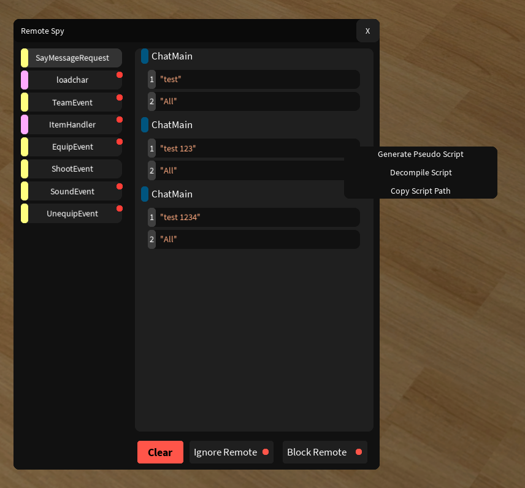
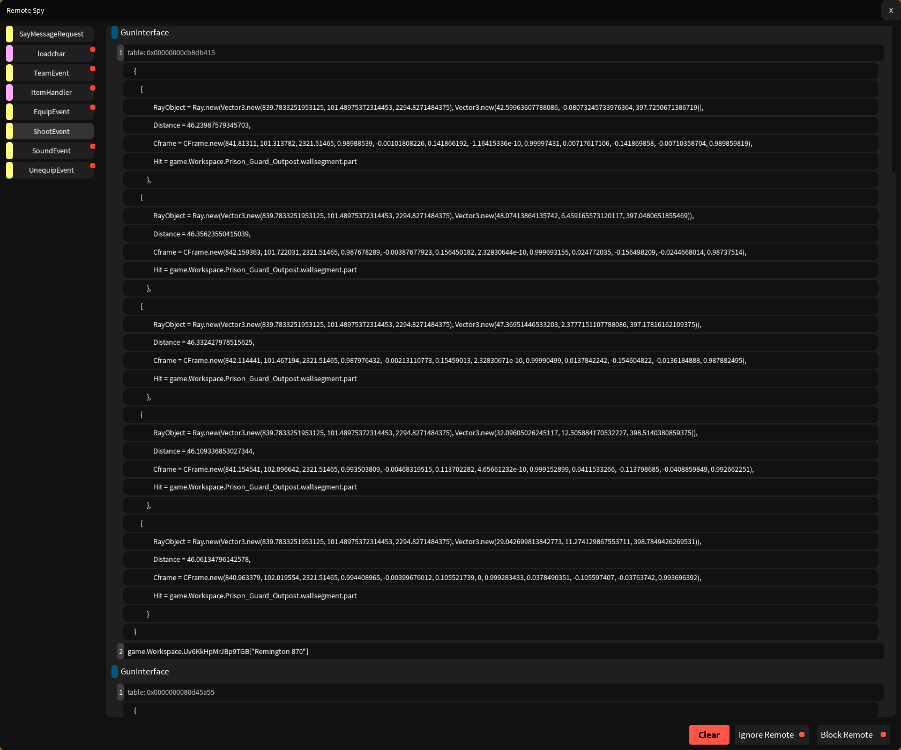

# Remote Spy

A remote spy designed to be simple and easy to use.  
v2 will include more features and optimizations down the line,  
and include a major refactor of this messy code.

## Features
* Generate Pseudocode scripts
* Parallel lua support (lol)
* Lightweight
* Intuitive UI

## Installation
```lua
loadstring(game:HttpGetAsync("https://github.com/FromThePoisonWell/RemoteSpy/releases/latest/download/init.lua"))()
```



